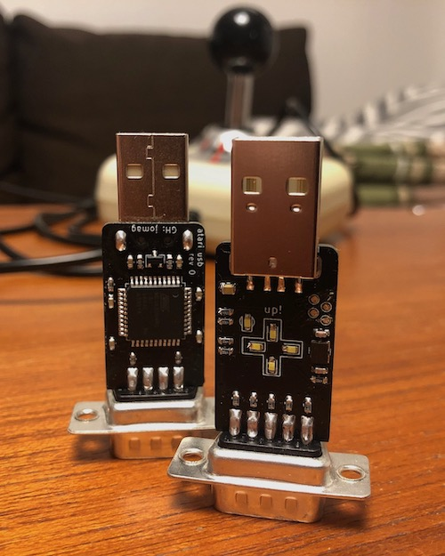

Atari USB
=========

This repo contains the PCB and firmware of an Atari joystick to USB
adapter, allowing old, golden joysticks such as TAC-2 to be used with
modern computers, or products such as "The C64" that use USB for
joysticks.

**The C64 is picky about joysticks, and this firmware has not yet
been confirmed to be compatible with it. This will be updated.**

Architecture
------------

The adapter is primarily built around an ATmega32u4 with an Arduino
bootloader. This allows the firmware to be tweaked and flashed using
the standard Arduino IDE. Board type: "Adafruit Feather 32u4".

PCB revisions
-------------

### Rev 0

Current revision.

Everything works, but the initial bootloader transfer is a bit
complicated as it requires temporary soldering an ISP header to
a few pads on the board. This will be revisited for rev 1.

Firmware
--------

Current firmware is very simplistic, but it works well. The joystick
HID code was copied from Matthew Heironimus.

License
-------

The current release contains code from Matthew Heironimus under
the LGPL license, so the entire project is LGPL for now.

